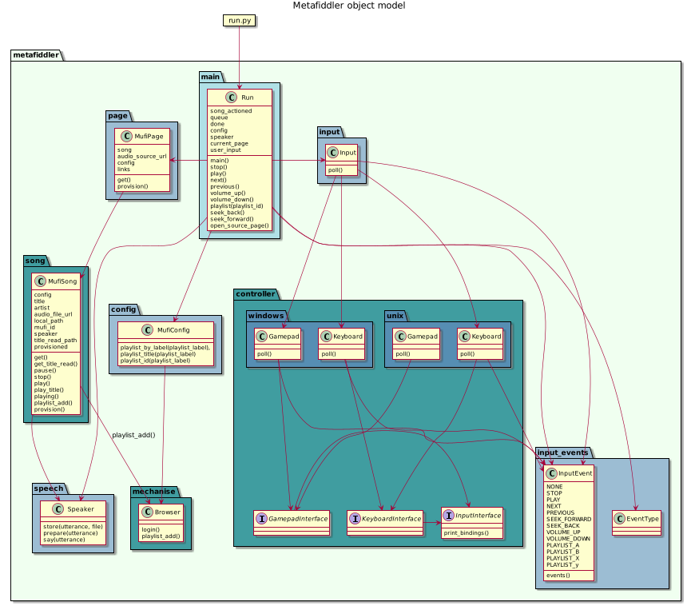

# metafiddler

A sequential player and catalogger for music.metafilter.com

## Configuring

There are two useful files that can be set up but neither are necessary

~/.metafiddler.config -- a YAML file describing playlist mappings and directory overrides
~/.metafiddler.current -- a file containing the last URL accessed

echo -e "\nsource ~/Git/lifebuoy/bash/bashrc-common.sh\nsource ~/Git/lifebuoy/bash/bashrc-linux.sh\n" >> ~/.bashrc

## Launching

Installing on linux required some prerequisites ([https://www.pygame.org/wiki/CompileUbuntu]).  On ubuntu:

```sh

sudo apt-get install git python-dev python-numpy python-opengl \
    libsdl-image1.2-dev libsdl-mixer1.2-dev libsdl-ttf2.0-dev libsmpeg-dev \
    libsdl1.2-dev libportmidi-dev libswscale-dev libavformat-dev libavcodec-dev \
    libtiff5-dev libx11-6 libx11-dev fluid-soundfont-gm timgm6mb-soundfont \
    xfonts-base xfonts-100dpi xfonts-75dpi xfonts-cyrillic fontconfig fonts-freefont-ttf libfreetype6-dev

```

```sh
pip install -r requirements.txt
# Windows
./metafiddler.sh
# Linux
./run.py
```

## Object model



## Background

music.metafilter.com was about few months old when I first discovered it in 2006.  Much of the OG content was folks cleaning out their old recordings but in short order musicians were using it as another outlet for their online music and part if not an exclusive part of their site persona.  Contests drove thematic submissions and a growing body of really decent, earnest music was there for the mining.

This wasn't going to be anything you'd ever heard before and from people you'd never see.  Better, it was a curatable stream.

There's something in my gatherer's heart that got bitten hard by music collection in the early web days when things were free and easy and _weird_.  So many oddities just avaialble there and maybe never seen again.

I didn't want to miss anything good so when I started I started at the first track which was a public radio interview of the site's founder.  I think its a hidden track.

From there down the sequential road I travelled.

I cobbled up a web interface wrapper but I wanted a headless interface, one I didn't need to select into, it would just be there, monitoring and running.

## Disclaimer

The author is in not affiliated with MetaFilter Network LLC though is a longtime user and sometime member.
